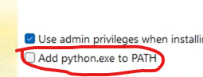
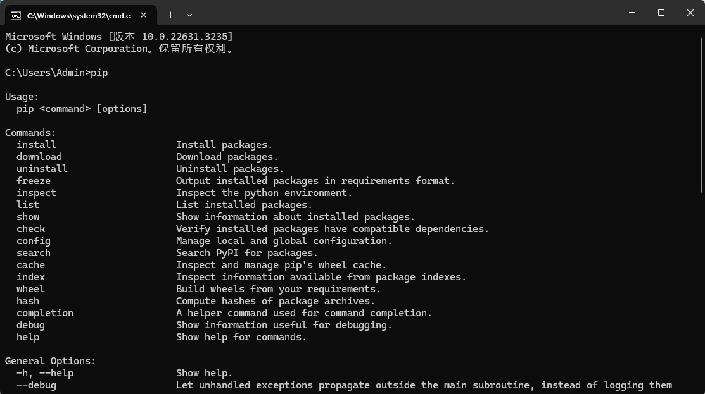
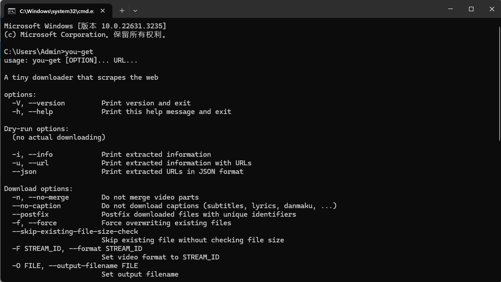
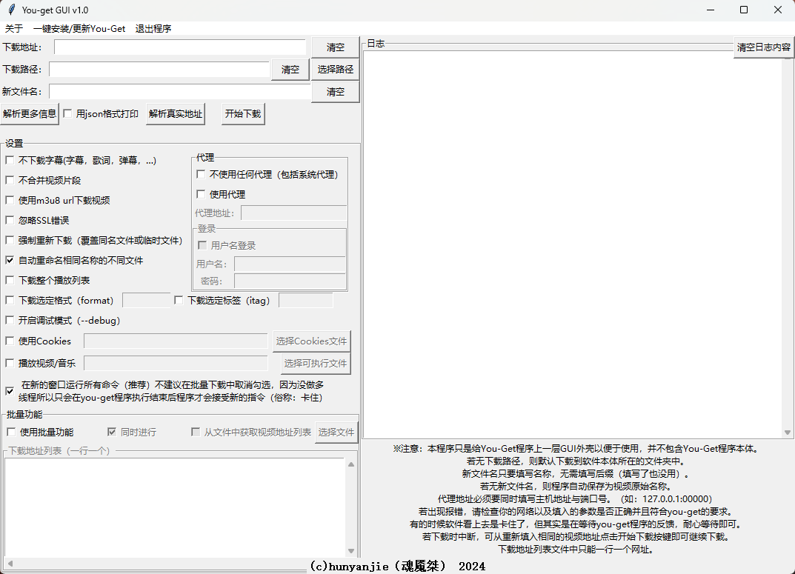
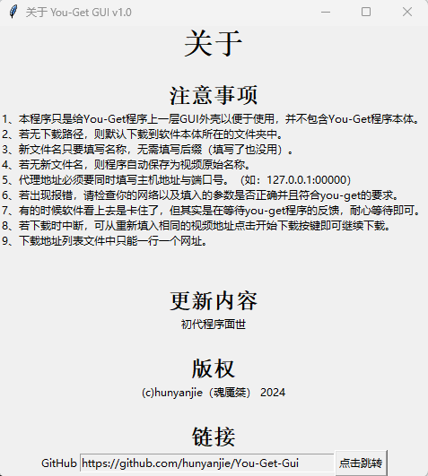
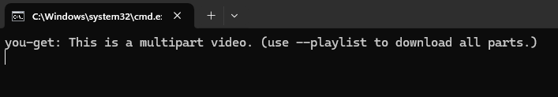

# 关于本程序（About）

给You-Get套上GUI以便于使用。

You-Get hooked up to a GUI for easy use.

# 安装/更新（Install/Update）
安装you-get库
Install the you-get library

```
pip install you-get
```

更新you-get库
Update the you-get library

```
pip install --upgrade you-get
```

# 注意事项（Notes）

中文：

1. 请确保您已经安装了Python和pip。
2. 本程序只是给You-Get程序上一层GUI外壳以便于使用，并不包含You-Get程序本体。 
3. 若无下载路径，则默认下载到"C:/Users/[用户名]"文件夹中。
4. 新文件名只要填写名称，无需填写后缀（填写了也没用）。 
5. 若无新文件名，则程序自动保存为视频原始名称。 
6. 代理地址必须要同时填写主机地址与端口号。（如：127.0.0.1:00000） 
7. 若出现报错，请检查你的网络以及填入的参数是否正确并且符合you-get的要求。 
8. 有的时候软件看上去是卡住了，但其实是在等待you-get程序的反馈，耐心等待即可。 
9. 若下载时中断，可从重新填入相同的视频地址点击开始下载按键即可继续下载。 
10. 下载地址列表文件中只能一行一个网址。

English:

1. Make sure you have Python, pip and you-get installed.
2. This program only gives You-Get program a layer of GUI shell for easy use, and does not contain You-Get program ontology.
3. If there is no download path, the file is downloaded to the C:/Users/[User name] folder by default.
4. As long as the new file name is filled in, there is no need to fill in the suffix (it is useless to fill in).
5. If there is no new file name, the program will automatically save the original name of the video.
6. The proxy address must be the host address and port number. (e.g. 127.0.0.1:00000)
7. If an error occurs, please check whether your network and the parameters you fill in are correct and meet the requirements of you-GET.
8. Sometimes the software seems to be stuck, but it is actually waiting for feedback from the you-get program. Just wait patiently.
9. If the download is interrupted, you can re-fill the same video address and click the Start download button to continue downloading.
10. Download the address list file only one URL line.

# 更新日志（Update Log）
2024-03-10 1.0.0 初始版本（Initial version）[下载地址/download](https://github.com/hunyanjie/You-Get-Gui/releases/tag/v1.0)

# You-Get GUI使用介绍（You-Get GUI Introduction）

## 关于本程序（About）

给You-Get套上GUI以便于使用。


[B站视频链接（Bilibili Video Link）](https://www.bilibili.com/video/BV15x4y1S7dJ)

软件开源地址：[https://github.com/hunyanjie/You-Get-Gui](https://github.com/hunyanjie/You-Get-Gui)

下载地址：[https://github.com/hunyanjie/You-Get-Gui](https://www.123pan.com/s/WS7bVv-L4X0H.html)    提取码：7WtN

## 安装（Install）
### 准备

安装前需要准备的文件下载地址
Python官方网址：[https://www.python.org/downloads/](https://www.python.org/downloads/)

Python 安装程序镜像网址：[https://mirrors.huaweicloud.com/python/](https://mirrors.huaweicloud.com/python/)

ffmpeg官网：[https://www.ffmpeg.org/](https://www.ffmpeg.org/)

**我已经将所有有需要的文件放在了网盘中，想要自己下载的可以忽视** 

#### 开始安装

#### 1：安装Python

一定要记得将Add python.exe.to PATH勾选❗⚠️



按【Windows徽标+R】弹出【运行】窗口，输入【cmd】（不用带“【”和“】”）。命令行窗口打开后输入【pip】。若是出现下面的的这些东西就说明成功了↓



#### 2：安装ffmpeg

将压缩包（文件夹）中的【ffmpeg.exe】文件保存到【C:\Windows\System32】文件夹中，然后打开命令行工具（参考【安装python】后的检查步骤）输入【ffmpeg】（不用带“【”和“】”）。若是出现下面的这些东西就说明成功了↓



## 功能介绍

### 主体

这个软件以左右布局为主，左边是用来输入，右边是用来输出结果以及部分提示信息。



菜单栏
关于：注意事项、更新的内容、版权申明、GitHub网址



一键安装/跟新You-Get：调起cmd执行pip的安装或更新you-get任务

退出程序：顾名思义，退出程序

### 左半部分

【下载地址】：填写要下载的视频网址

【下载路径】：下载的视频保存至本地的文件路径（右边的选择路径可以帮你快速填写文件路径）。若是不填写则默认下载到程序本体所在的目录中。

【新文件名】：下载视频后设置的保存文件名。若是留空则以文件默认名称保存。

【清空】按键：一键清空右边对应空格中填写的所有内容。

【解析更多信息】按键：不下载视频而是将视频所有可以下载的质量信息罗列出来。

【用json格式打印】按键：勾选后按【解析更多信息】按键打印出的视频质量信息会以json格式展现。

【解析真实地址】按键：不下载视频而是将视频真实地址（可以直接在浏览器中访问并下载的视频地址）打印出来。可以配合【format】或【itag】设置指定获取具体视频质量的视频地址。默认获取占用空间最大/视频清晰度最高的视频真实地址。

【开始下载】按键：调起下载程序进行下载视频。可以配合【format】或【itag】设置指定下载的特定视频质量的视频。默认下载占用空间最大/视频清晰度最高的视频。

【不下载字幕】选项：勾选后不下载包括字幕、歌词文件在内的附加文件。

【不合并视频片段】选项：勾选后不会将下载的视频片段进行合并。若之后要合并请手动合并

可以尝试用【ffmpeg -i video.m4s -i audio.m4s -c:v copy -c:a copy output.mp4】命令合成，注意改名称和后缀名（不推荐，我没试过，所以不知道能不能正常使用）
【使用m3u8 url下载视频】选项：部分视频时m3u8格式的，若正常的下载流程无法下载视频则可以尝试勾选这个选项再试试。

【忽略SSL错误】选项：可能会出现能正常获取视频清晰度信息但无法下载视频的情况，勾选这个选项再试试。

【强制重新下载（覆盖同名文件或临时文件）】选项：故名思意，强制重新下载视频。

【自动重命名相同名称的不同文件】选项：顾名思义，就是当下载到相同名称的不同视频时自动重命名。默认勾选。

【下载整个播放列表】选项：将整个视频列表中的视频都下载下来，适用于下载B站的多P视频（暂时无法指定下载具体第几个到第几个视频）。若是普通下载时出现这一行字就说明可以使用这个功能↓



【下載选定格式（format)】【下载选定标签(itag)】选项：用来指定下载对应清晰度的视频。著所以会出现两种是因为有的视频获取到的信息只有format标签或只有itag标签。

【开启调试模式（--debug）】选项：出现问题时程序打印执行任务的过程中每一步的信息以帮助用户找到问题出现在哪里。

【使用Cookies】选项：导入Cookies文件以实现获取需要登入才能下载的视频。

【播放视频/音乐】选项：将视频流推入播放器中以实现不下载就可以在本地播放视频。注意：这个功能能否正常运行取决于你的播放器对这种视频播放方式的支持程度以及你的网络质量。这时原本的【开始下载】按键会变成【播放】按键，直接点击即可播放视频。

【代理】|【不使用任何代理（包括系统代理)】选项：顾名思义，就是告诉下载器不要使用任何代理直接与视频网站建立连接下载视频，就是系统有代理也不使用。

【代理】|【使用代理】|【代理地址】：填入Socks5代理主机地址以及端口号（HTTP代理将会在下一个版本中支持）。格式如下【127.0.0.1:00000】。（注意：一定要填端口号，并且确保冒号时英文的冒号）

【代理】|【使用代理】|【登录】：若是使用的代理需要登录，就在这边填入用户名和登录密码。

【在新的窗口运行所有命令】选项：推荐。由于本程序是单进程程序，所以若是不勾选这个选项，调起you-get程序执行视频获取操作时会卡住，直到you-get程序执行完毕后软件才能正常工作。

【批量功能】：批量下载视频的功能

【批量功能】|【同时进行】选项：将不同的视频获取操作在不同的下载进程中同时进行。若是不勾选，则会在一个进程中获取完一个视频再获取一个视频，若是中间出现问题整个下载进程就会因为报错而终止。（我无法解决这个问题，这个问题是发生在you-get程序中的，我只有帮你调起you-get进程的功能）

【批量功能】|模式一：直接在下方的多行文本框中输入视频链接.注意：一行一个视频链接。

【批量功能】|模式二：从TXT文件中获取视频下载链接。需要勾选【从文件中获取视频地址列表】选项并按右边的【选择文件】按键获取TXT文件地址。文件路径会出现在原本填写单条视频网址的地方。注意：txt文件中的视频地址也是一行一个。

### 右半部分

【日志】：显示调起you-get工具的命令。若是已经取消勾选【在新的窗口运行所有命令】选项，这里则会显示you-get进程结束后返回的所有内容。注意：这个日志不会保留在本地，每一次关闭程序都会清除这些日志。

【清空日志内容】按键：一键清空日志的所有内容

## 部分问题的解决办法

### 1、可以浏览视频信息但无法下载？

勾选【忽略SSL错误】选项后重试

### 2、B站视频无法下载？

打开命令行输入【pip show you-get】，找到【Location】这一栏，用文件资源管理器打开后的文件路径，接着找到【you-get】目录打开，再找到【extractors】目录打开，找到【bilibili.py】文件，用IDLE编辑器打开

在大概<kbd>第103行</kbd>的位置找到

```Python
return 'https://interface.bilibili.com/v2/playurl?%s&sign=%s' % (params, chksum)
```

将其替换成

```Python
return "https://api.bilibili.com/x/player/wbi/v2?%s&sign=%s" % (params, chksum)
```

然后保存即可

# 赞赏（Donate)
WeChat:

or
USDT-Ethereum:0xdc737c8fb58b520e07da9a777d77d700e57f661f
